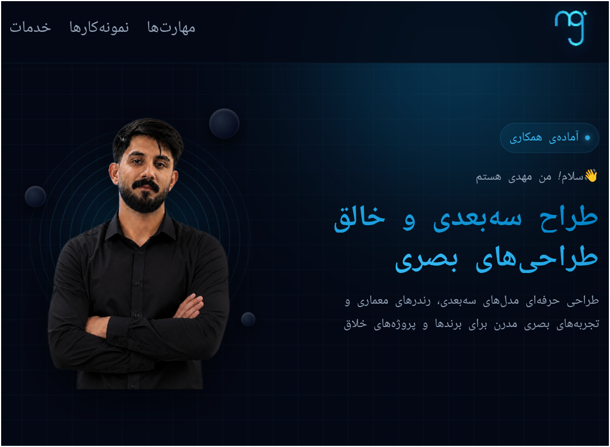
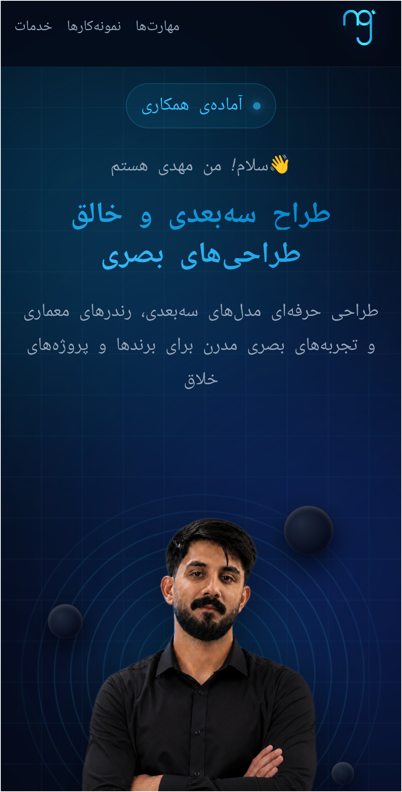

# 🎨 پرتفولیوی مهدی | 3D Designer Portfolio

### وب‌سایت شخصی یک طراح سه‌بعدی

 

 

طراحی و پیاده‌سازی وب‌سایت پرتفولیو برای یک طراح سه‌بعدی،
با تم تیره، المان‌های فضایی و طراحی کاملاً ریسپانسیو.

 

[🌐 مشاهده‌ی آنلاین](#-پیش‌نمایش) • [✨ ویژگی‌ها](#-ویژگی‌ها) • [🎯 خدمات](#-خدمات)

---

## 📸 پیش‌نمایش

> 🖼️ **در حال آماده‌سازی اسکرین‌شات‌ها...**

  
    
  

---

## ✨ ویژگی‌ها

<table>
  <tr>
    <td>🌌 <b>تم تیره و فضایی</b></td>
    <td>پس‌زمینه‌ی تیره با المان‌های مداری و ستاره‌ای</td>
  </tr>
  <tr>
    <td>📱 <b>کاملاً ریسپانسیو</b></td>
    <td>تجربه‌ی یکسان روی موبایل، تبلت و دسکتاپ</td>
  </tr>
  <tr>
    <td>🎯 <b>Hero Section جذاب</b></td>
    <td>عکس پروفایل + معرفی حرفه‌ای + CTA</td>
  </tr>
  <tr>
    <td>🛠️ <b>نمایش مهارت‌ها</b></td>
    <td>کارت‌های Blender، Photoshop و Illustrator</td>
  </tr>
  <tr>
    <td>🖼️ <b>نمونه‌کارها</b></td>
    <td>نمایش پروژه‌ها با تگ‌های نرم‌افزار و توضیحات</td>
  </tr>
  <tr>
    <td>💼 <b>خدمات</b></td>
    <td>لیست خدمات با توضیحات کامل</td>
  </tr>
  <tr>
    <td>⚡ <b>انیمیشن‌های ظریف</b></td>
    <td>افکت‌های نرم روی هاور و ورود عناصر</td>
  </tr>
</table>

---

## 🛠️ تکنولوژی‌ها

| تکنولوژی | کاربرد |
|:---:|:---:|
| **HTML5** | ساختار صفحات |
| **CSS3** | استایل، چیدمان و انیمیشن |
| **CSS Grid** | چیدمان بخش‌ها |
| **Flexbox** | چیدمان اجزای داخلی |
| **CSS Variables** | مدیریت رنگ‌ها و فونت‌ها |
| **Media Queries** | ریسپانسیو در سه سطح |

---

## 📂 ساختار پروژه
